# Meteor's Complete Reactivity System: From Database to UI

Meteor's reactivity system is one of its most powerful features, providing real-time updates from database changes to user interfaces. This comprehensive guide explains the entire process, from polling to change streams, and how data flows between backend and frontend.

## Table of Contents

1. [Overview of Reactivity Architecture](#overview)
2. [Client-Side Reactivity: Tracker and Minimongo](#client-side)
3. [DDP: The Communication Protocol](#ddp)
4. [Server-Side Change Detection](#server-side)
5. [Complete Data Flow](#data-flow)
6. [Performance Considerations](#performance)
7. [Modern Alternatives](#alternatives)

## Overview of Reactivity Architecture {#overview}

Meteor's reactivity system consists of several interconnected components working together to provide seamless real-time updates:

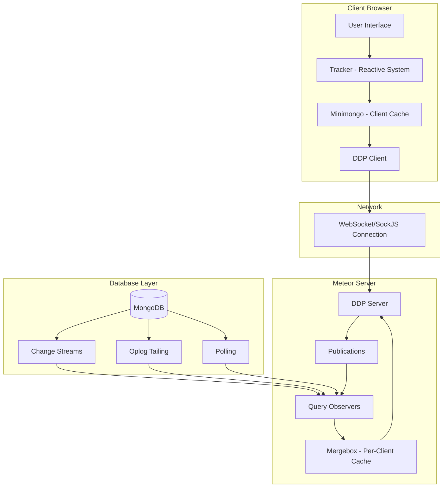

## Client-Side Reactivity: Tracker and Minimongo {#client-side}

### Tracker: Transparent Reactive Programming

Tracker is Meteor's reactive programming system that automatically tracks dependencies and reruns computations when data changes.

#### How Tracker Works

1. **Computation Creation**: When you call `Tracker.autorun()`, it creates a `Computation` object
2. **Dependency Tracking**: During execution, reactive data sources register dependencies
3. **Invalidation**: When data changes, dependencies trigger computation invalidation
4. **Recomputation**: Invalid computations automatically rerun

```javascript
// Example of Tracker in action
Tracker.autorun(() => {
  // This computation depends on reactive data sources
  const user = Meteor.user();
  const todos = Todos.find({ userId: user?._id });
  
  // UI automatically updates when user or todos change
  updateUI(todos.fetch());
});
```

#### Tracker Architecture

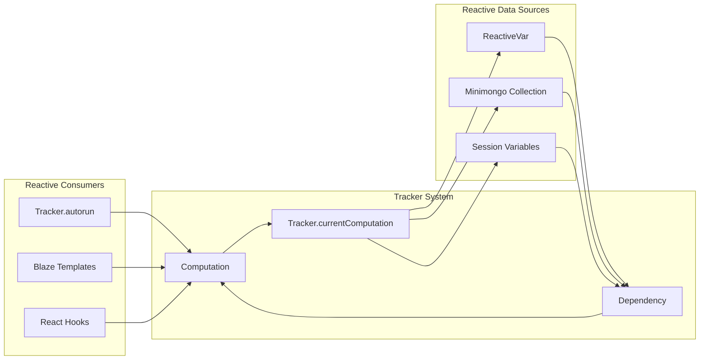

### Minimongo: Client-Side Database Cache

Minimongo is an in-memory JavaScript implementation of MongoDB that serves as the client-side cache.

#### Key Features

- **Synchronous API**: Queries return immediately from local cache
- **MongoDB Compatibility**: Same API as server-side MongoDB
- **Optimistic Updates**: Changes applied locally first, then synced to server
- **Latency Compensation**: Users see changes instantly

#### Minimongo Architecture

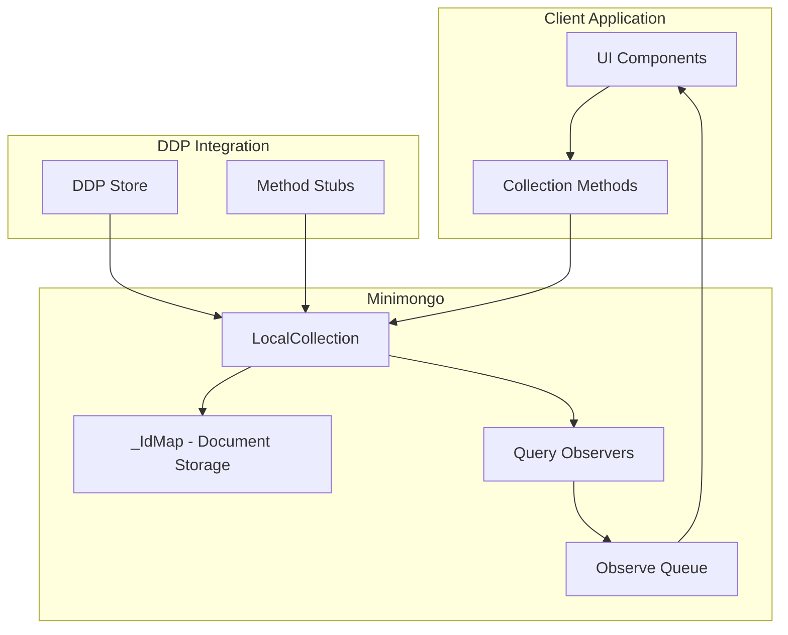

#### Optimistic UI Flow

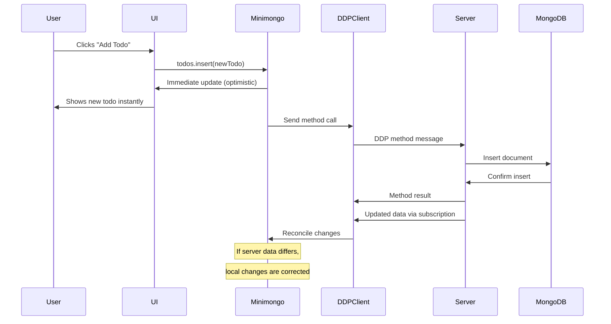

## DDP: The Communication Protocol {#ddp}

DDP (Distributed Data Protocol) is Meteor's real-time protocol that enables bidirectional communication between client and server.

### DDP Message Types

#### Subscription Messages
- `sub`: Client subscribes to a publication
- `unsub`: Client unsubscribes
- `ready`: Server indicates subscription is ready
- `nosub`: Server indicates subscription stopped

#### Data Messages
- `added`: Document was added to subscription
- `changed`: Document was modified
- `removed`: Document was removed

#### Method Messages
- `method`: Client calls a server method
- `result`: Server returns method result
- `updated`: Server confirms all writes are complete

### DDP Flow Example

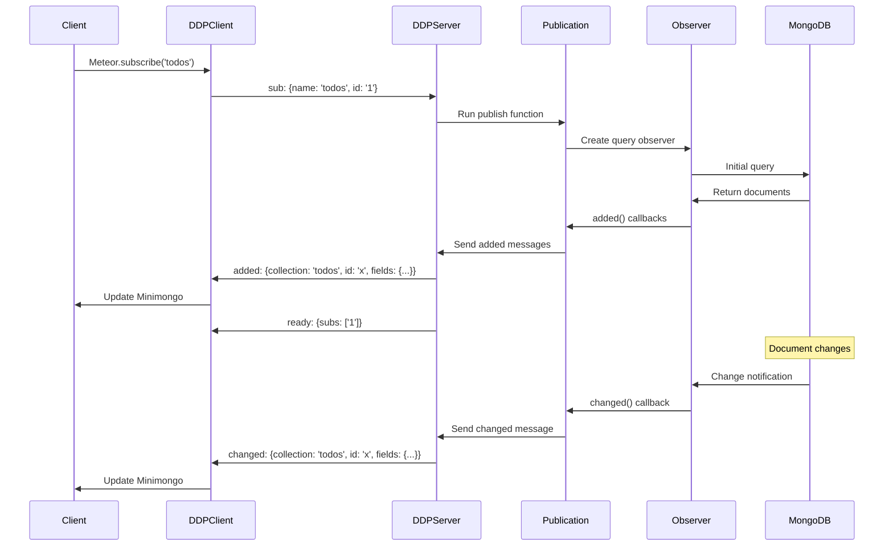

### Mergebox: Server-Side Per-Client Cache

The Mergebox maintains a cache of what data each client has received, enabling efficient delta updates.

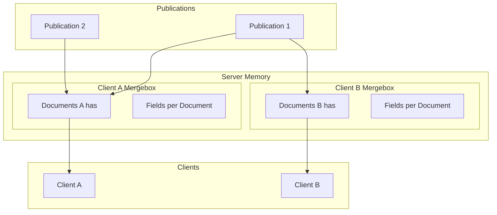

## Server-Side Change Detection {#server-side}

Meteor supports three different mechanisms for detecting database changes, each with different performance characteristics and requirements.

### 1. Polling (PollingObserveDriver)

The simplest but least efficient method that periodically re-runs queries to detect changes.

#### How Polling Works

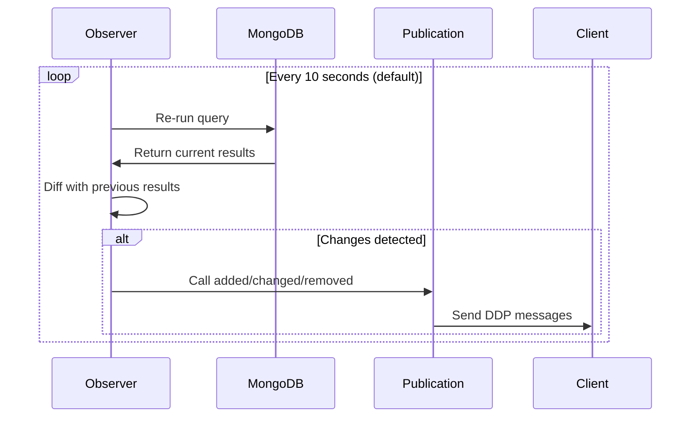

#### Polling Characteristics
- **Pros**: Works with any MongoDB setup, simple implementation
- **Cons**: High latency (up to polling interval), resource intensive
- **Use Cases**: Development, simple deployments, unsupported query types

### 2. Oplog Tailing (OplogObserveDriver)

Reads MongoDB's operations log to detect changes in real-time.

#### Oplog Architecture

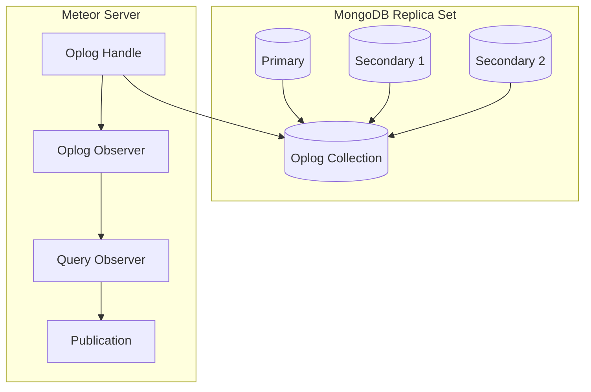

#### Oplog Processing Flow

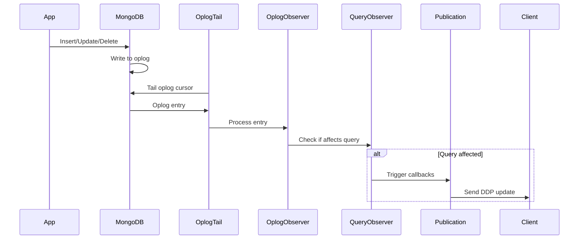

#### Oplog Entry Processing

```javascript
// Example oplog entry for an insert
{
  "ts": ...,           // Timestamp
  "t": ...,            // Term
  "h": ...,            // Hash
  "v": 2,              // Version
  "op": "i",           // Operation type (i=insert, u=update, d=delete)
  "ns": "myapp.todos", // Namespace (database.collection)
  "o": {               // Operation document
    "_id": ObjectId("..."),
    "text": "New todo",
    "done": false
  }
}
```

#### Oplog Requirements
- MongoDB replica set (required)
- Special oplog reader user with read access to `local` database
- `MONGO_OPLOG_URL` environment variable

### 3. Change Streams (ChangeStreamObserveDriver)

Modern MongoDB feature (3.6+) that provides real-time change notifications.

#### Change Streams Architecture

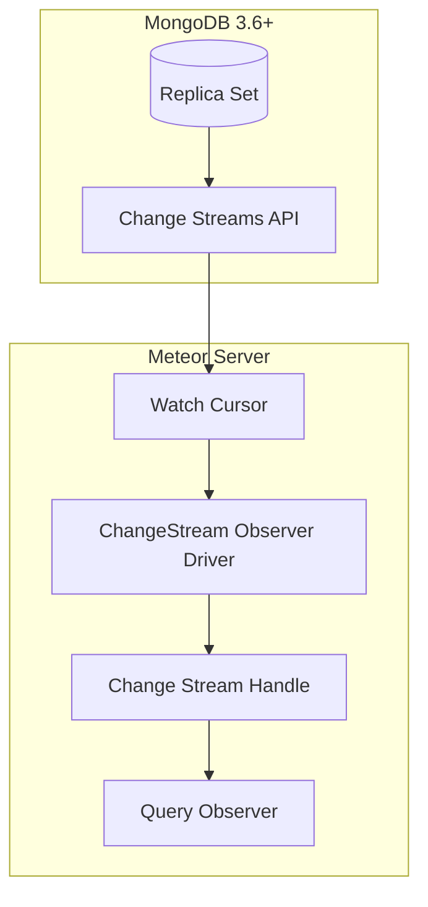

#### Change Stream Flow

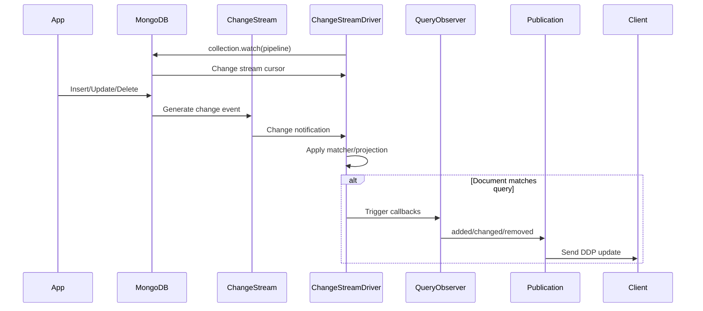

### Driver Selection Algorithm

Meteor automatically chooses the best available driver based on several factors:

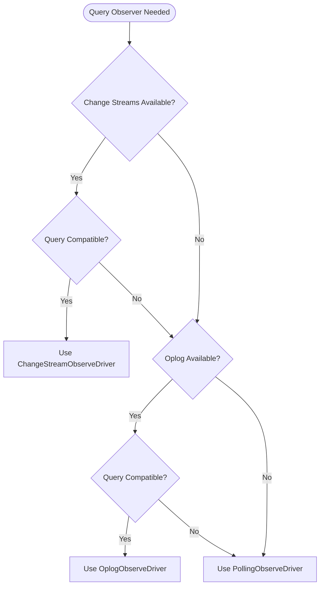

### How to force to use each Observer Driver {#driver-activation}

#### 1. Polling Observer Driver (Default)

The polling driver is automatically activated when your mongodb isn't a replicaset.

**Characteristics:**
- Requires no special configuration
- Works with any MongoDB installation
- Used as fallback when other drivers are not available

**Environment Variables:**
```bash
MONGO_URL=mongodb://localhost:27017/myapp
```

#### 2. Oplog Observer Driver

Requires a MongoDB replica set and oplog access.

**Prerequisites:**
- MongoDB configured as replica set
- User with read access to the `local` database
- Oplog access via `MONGO_OPLOG_URL`

**MongoDB Replica Set Configuration:**
```bash
# 1. Start MongoDB with replica set
mongod --replSet rs0 --dbpath /data/db

# 2. In mongo shell, initialize replica set
rs.initiate({
  _id: "rs0",
  members: [
    { _id: 0, host: "localhost:27017" }
  ]
})

# 3. Create oplog user (optional but recommended)
use admin
db.createUser({
  user: "oplogReader",
  pwd: "password",
  roles: [
    { role: "read", db: "local" },
    { role: "readAnyDatabase", db: "admin" }
  ]
})
```

**Environment Variables:**
```bash
# Main database URL
MONGO_URL=mongodb://localhost:27017/myapp?replicaSet=rs0

# Oplog URL (same server, local database)
MONGO_OPLOG_URL=mongodb://localhost:27017,localhost:27018,localhost:27019/local?replicaSet=rs0
```

#### 3. Change Streams Observer Driver (Recommended)

Available in MongoDB 3.6+ and is the most efficient method.

**Prerequisites:**
- MongoDB 3.6 or higher
- Configured as replica set or sharded cluster
- Meteor 3.4 or higher

**MongoDB Configuration:**
```bash
# For local development - simple replica set
mongod --replSet rs0 --dbpath /data/db

# In mongo shell
rs.initiate()

# For production - multi-node cluster
# (configuration varies by infrastructure)
```

**Environment Variables:**
```bash
# Change streams are automatically enabled when available
# URL with replica set (required for change streams)
MONGO_URL=mongodb://localhost:27017,localhost:27018,localhost:27019/local?replicaSet=rs0
```

**Advanced Configuration:**
```javascript
// settings.json
{
  "packages": {
    "mongo": {
      "useChangeStreams": false
    }
  }
}
```

## Complete Data Flow {#data-flow}

Let's trace a complete example of how a todo item addition flows through the entire system:

### Scenario: User adds a new todo item

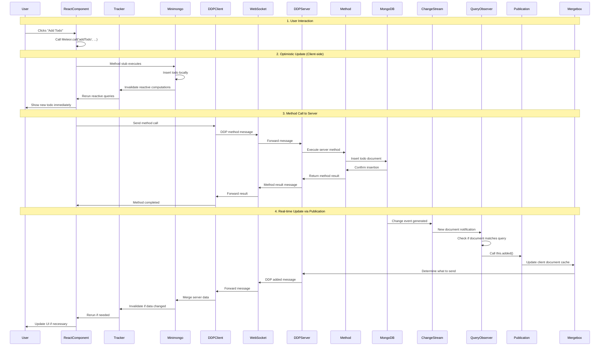

### Error Handling and Reconciliation

If the server method fails or returns different data:

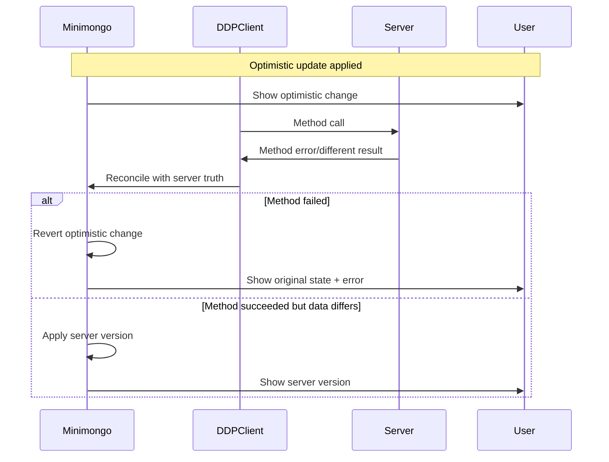

## Performance Considerations {#performance}

### Change Detection Performance Comparison

| Method | Latency | CPU Usage | Memory Usage | Scalability | Setup Complexity |
|--------|---------|-----------|--------------|-------------|------------------|
| Polling | High (10s) | High | Low | Poor | Low |
| Oplog | Low (ms) | Medium | Medium | Good | Medium |
| Change Streams | Low (ms) | Low | Low | Excellent | Low |

## Conclusion

Meteor's reactivity system provides a powerful foundation for building real-time applications. Understanding the complete flow from database changes to UI updates helps developers:

1. **Choose appropriate strategies** for different use cases
2. **Optimize performance** by understanding the underlying mechanisms
3. **Debug issues** by knowing where problems might occur
4. **Scale applications** effectively by selecting the right tools

The evolution from polling to change streams shows Meteor's commitment to leveraging modern database features while maintaining backward compatibility and ease of use.

### Key Takeaways

- **Tracker** provides transparent reactivity on the client
- **Minimongo** enables optimistic UI with client-side caching
- **DDP** handles real-time communication efficiently
- **Multiple change detection methods** provide flexibility and performance
- **Understanding the full flow** helps with optimization and debugging
